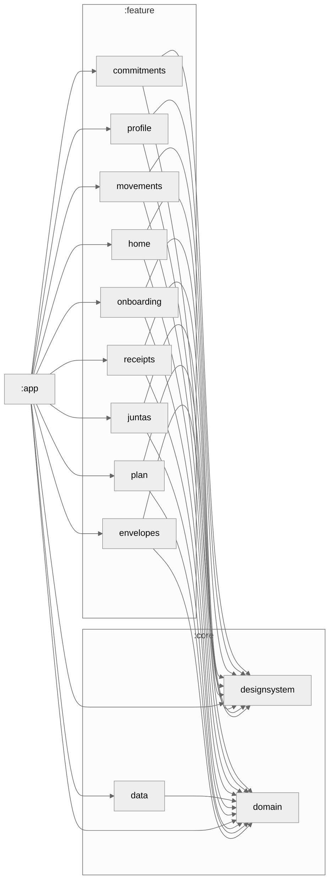

# Kipu

App Android de finanzas personales para usuarios en Perú.

## Estado y documentación

Revisión documental: **12 septiembre 2026**. Kotlin + Jetpack Compose, almacenamiento local Room v22 y DataStore; 13 módulos Gradle. El nombre visible es **Cuentas compartidas**, aunque el módulo técnico sigue siendo `:feature:juntas`.

La auditoría del 9 de septiembre encontró **4 HIGH, 2 MEDIUM y 2 LOW**. Se corrigieron H01–H04, M01–M02, L01 y una colisión de IDs manuales descubierta después (H05). Verificación: **551 unitarias, 48 pruebas de la app y 55 de datos PASS**, junto con `assembleDebug` y `lintDebug` (50 entradas de advertencia, 0 errores). Atrás (L02) sigue en observación, sin causa reproducida. Consulte el [seguimiento de remediación](docs/qa/REMEDIATION_2026-09-09.md). No se certificó una app sin bugs ni producción; no se realizaron acciones en Play Console.

- [Índice de documentación](docs/README.md).
- [Estado actual y pendientes](docs/ai/PROJECT_STATE.md).
- [Cómo funciona Kipu](docs/qa/KIPU_USER_GUIDE.md).
- [Auditoría vigente](docs/qa/KIPU_AUDIT_2026-09-09.md) y [resultados reproducibles](docs/qa/VERIFICATION_2026-09-09.md).
- [QA en dispositivo](docs/ai/E2E_QA_CHECKLIST.md) y [preparación de publicación](docs/release/INTERNAL_TESTING.md).

## Preparación local

La ruta actual de esta copia es `/media/toshiba/gerson/PROYECTOS/proyectos/kipu`; no usar la antigua `/home/gerson/proyectos/kipu`. En otra máquina, usar la raíz de su checkout. Se necesita Android SDK configurado en `local.properties`; Gradle declara JDK 21 para el daemon en `gradle/gradle-daemon-jvm.properties` y resuelve las toolchains de los módulos.

```bash
cd /media/toshiba/gerson/PROYECTOS/proyectos/kipu
./gradlew :core:domain:test testDebugUnitTest assembleDebug lintDebug
adb devices -l
./gradlew --no-daemon --max-workers=1 --continue :core:data:connectedDebugAndroidTest :app:connectedDebugAndroidTest
```

`core:domain` es JVM: su tarea es `:core:domain:test`, no `testDebugUnitTest`. `--offline` solo funciona con todas las dependencias ya en caché. Las pruebas instrumentadas instalan APK debug y pueden cambiar datos de prueba: utilizar dispositivo/perfil dedicado, no una instalación con finanzas reales. No mezclar estas tareas con la validación del AAB de Play.

## Funciones y límites

Registro manual o por voz con revisión, comprobantes compartidos/seleccionados sin cámara propia, pagos mensuales con importes reales, sobres diarios/semanales/mensuales, reserva acumulada, propuestas de reajuste, metas y exportación JSON v5/CSV. No hay sincronización bancaria ni garantía de llegar a fin de mes; consultar las limitaciones financieras abiertas antes de confiar en la cobertura de una compra grande.

## Project Module Graph


