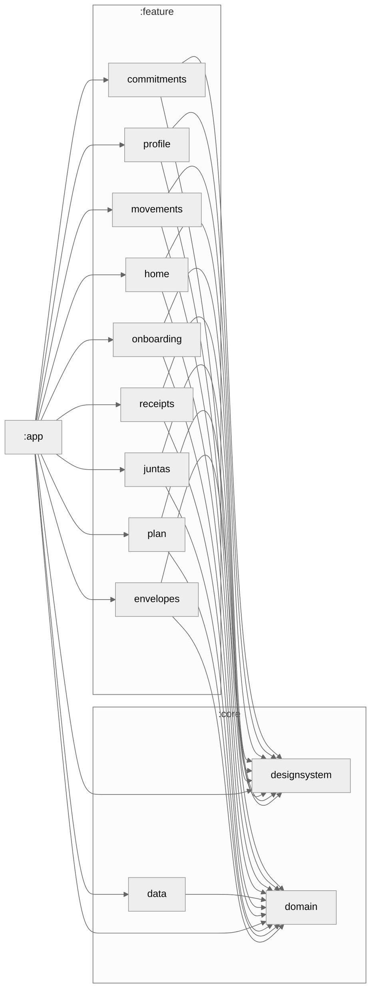

# Kipu

App Android de finanzas personales para usuarios en Perú.

## Project Module Graph

```mermaid
%%{
  init: {
    'theme': 'neutral'
  }
}%%

graph LR
  subgraph :core
    :core:designsystem["designsystem"]
    :core:domain["domain"]
    :core:data["data"]
  end
  subgraph :feature
    :feature:envelopes["envelopes"]
    :feature:plan["plan"]
    :feature:juntas["juntas"]
    :feature:receipts["receipts"]
    :feature:home["home"]
    :feature:movements["movements"]
    :feature:commitments["commitments"]
    :feature:profile["profile"]
    :feature:onboarding["onboarding"]
  end
  :feature:envelopes --> :core:designsystem
  :feature:envelopes --> :core:domain
  :feature:plan --> :core:designsystem
  :feature:plan --> :core:domain
  :feature:juntas --> :core:designsystem
  :feature:juntas --> :core:domain
  :app --> :feature:receipts
  :app --> :core:designsystem
  :app --> :core:domain
  :app --> :core:data
  :app --> :feature:home
  :app --> :feature:movements
  :app --> :feature:envelopes
  :app --> :feature:commitments
  :app --> :feature:profile
  :app --> :feature:onboarding
  :app --> :feature:plan
  :app --> :feature:juntas
  :feature:receipts --> :core:designsystem
  :feature:receipts --> :core:domain
  :feature:onboarding --> :core:designsystem
  :feature:onboarding --> :core:domain
  :core:data --> :core:domain
  :feature:home --> :core:designsystem
  :feature:home --> :core:domain
  :feature:movements --> :core:designsystem
  :feature:movements --> :core:domain
  :feature:profile --> :core:designsystem
  :feature:profile --> :core:domain
  :feature:commitments --> :core:designsystem
  :feature:commitments --> :core:domain
```