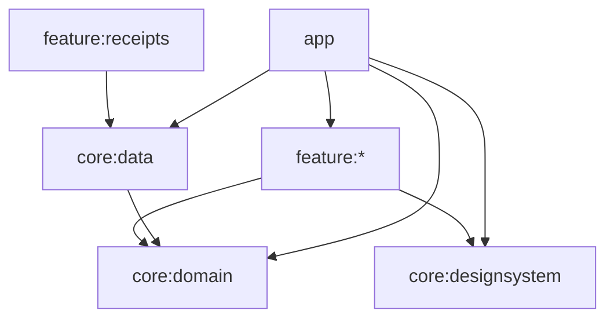

# Auditoría Kipu — 2026-06-21

> Auditoría sistemática del repositorio (14 módulos Gradle, 434 archivos `.kt`). **Sin modificaciones de código.** Metodología ECC + checklists en `docs/ai/`.

---

## Resumen ejecutivo

Kipu es un MVP Android funcional con arquitectura multi-módulo coherente: dominio JVM puro (`core:domain`, 239 tests), persistencia Room v11, y 10 features Compose. La suite unitaria y `lintDebug` pasan; `assembleDebug` compila sin errores.

No se encontraron fugas de datos financieros en logs ni bypass de confirmación humana en flujos OCR/notificación. Los riesgos dominantes son: **migración v7→v8 que borra `envelopeIds`**, **wizard de plan sin estado Error**, **validación de plan desalineada con ingresos vinculados a metas**, **acoplamiento `feature:receipts` → `core:data`**, y **cobertura E2E/manual no ejecutada** (dispositivo no conectado).

**Veredicto auditoría:** LISTO (informe completo).  
**Veredicto release Play Store (opinión):** NO LISTO hasta E2E en dispositivo + QA manual Yape/Plin.

---

## Veredicto por área

| Área | Estado | Notas |
|------|--------|-------|
| Compilación (`assembleDebug`) | OK | PASS |
| Tests unitarios (`testDebugUnitTest` + `:core:domain:test`) | OK | PASS |
| Lint (`lintDebug`) | OK | PASS |
| E2E instrumentado | NO LISTO | Dispositivo `ZT322PDDPK` no encontrado |
| QA manual pre-release | NO LISTO | No ejecutado (requiere hardware + Yape/Plin) |
| Arquitectura / dependencias | PARCIAL | Sin cruces feature↔feature; `receipts→data` viola ideal AGENTS.md |
| Dominio / parsers / plan | PARCIAL | TDD sólido; gaps plan vs ingresos vinculados |
| Datos / Room / migraciones | PARCIAL | v11 OK; migración 7→8 destructiva; tests migración incompletos |
| Seguridad / privacidad | OK | Sin logs sensibles; backup excluye DB; confirmación humana respetada |
| Features / UX errores | PARCIAL | Movements tiene retry; plan sin Error; 5 VMs sin retry |

---

## Inventario del repositorio

| Módulo | Archivos `.kt` | Unit tests | Instrumented |
|--------|----------------|------------|--------------|
| `:app` | 25 | 1 | 9 |
| `:core:designsystem` | 28 | 0 | 0 |
| `:core:domain` | 236 | 67 archivos (~239 métodos) | 0 |
| `:core:data` | 107 | 13 | 4 |
| `:feature:home` | 5 | 1 | 0 |
| `:feature:movements` | 15 | 0 | 0 |
| `:feature:envelopes` | 6 | 0 | 0 |
| `:feature:commitments` | 5 | 0 | 0 |
| `:feature:profile` | 5 | 0 | 0 |
| `:feature:onboarding` | 3 | 0 | 0 |
| `:feature:plan` | 5 | 0 | 0 |
| `:feature:receipts` | 8 | 0 | 0 |
| `:feature:juntas` | 4 | 0 | 0 |
| **Total** | **434** | **82 archivos** | **13 archivos** |

- **Room:** versión **11** (`KipuDatabase.kt`); migraciones `MIGRATION_1_2` … `MIGRATION_10_11`.
- **Discrepancia doc:** `AGENTS.md` y `PROJECT_STATE.md` mencionan Room v4 en varias secciones; código en v11.

---

## Comandos ejecutados y resultados

| Comando | Resultado |
|---------|-----------|
| `./gradlew testDebugUnitTest` | **PASS** |
| `./gradlew :core:domain:test` | **PASS** (239 tests) |
| `./gradlew assembleDebug` | **PASS** |
| `./gradlew lintDebug` | **PASS** |
| `./gradlew :app:connectedDebugAndroidTest` | **FAIL** — `DeviceException: Connected device with serial 'ZT322PDDPK' not found!` |

---

## Cobertura TDD vs checklist

| Lógica obligatoria (TDD_CHECKLIST) | Tests | Estado |
|-----------------------------------|-------|--------|
| Parser Yape / Plin | `YapeReceiptParserTest`, `PlinReceiptParserTest`, notificaciones | OK |
| `PenAmountParser` | `PenAmountParserTest` | OK |
| Sobres / presupuesto semanal | `CalculateWeeklyEnvelopeTotalsUseCaseTest`, etc. | OK |
| Disponible diario | `CalculateDailyAvailableUseCaseTest` | OK |
| Gastos hormiga | `DetectAntSpendingUseCaseTest`, weekly limit | OK |
| Duplicados | `DetectDuplicateMovementUseCaseTest`, matcher, pairs | OK |
| Validación plan financiero | `ValidateFinancialPlanUseCaseTest`, `SavingsGoalBurdenCalculatorTest` | OK (con gaps funcionales, ver AUD-004) |
| Metas — progreso con ingresos vinculados | `CommitmentLinkedIncomeCalculatorTest`, `ObserveCommitmentSummariesUseCaseTest` | OK en summaries; no en validación plan |
| Features (ViewModels / UI) | Casi sin tests unitarios | GAP |
| Migraciones v8–v11 | Sin tests instrumentados dedicados | GAP |
| `PendingPlanWizardInstrumentedTest` | Archivo ausente en repo | GAP (doc lo referencia) |

---

## Hallazgos

### CRITICAL

| ID | Módulo | Descripción | Evidencia | Recomendación |
|----|--------|-------------|-----------|---------------|
| — | — | *Ninguno en esta auditoría* | Flujos OCR/notificación/import requieren confirmación UI antes de persistir (`ConfirmSuggestedMovementWithDuplicateCheckUseCase`); no se detectaron logs con montos/OCR | — |

### HIGH

| ID | Módulo | Descripción | Evidencia | Recomendación |
|----|--------|-------------|-----------|---------------|
| AUD-001 | `core:data` | Migración **v7→v8** vacía `envelopeIds` del plan primario | `KipuDatabaseMigrations.kt` L160–171: `UPDATE financial_plans SET envelopeIds = ''` | Documentar en release notes; evaluar migración que preserve IDs existentes en upgrades futuros |
| AUD-002 | `feature:plan` | Wizard sin `PlanWizardUiState.Error`; fallo en `init` deja **Loading infinito** | `PlanWizardViewModel.kt` L76–150 sin try/catch; `PlanWizardScreen` solo Loading/Content | Añadir Error + manejo de excepciones en carga inicial |
| AUD-003 | QA | Suite E2E no ejecutada en esta sesión | `connectedDebugAndroidTest` FAIL — sin dispositivo | Conectar Moto G24 o emulador; correr `:app` + `:core:data` instrumented |

### MEDIUM

| ID | Módulo | Descripción | Evidencia | Recomendación |
|----|--------|-------------|-----------|---------------|
| AUD-004 | `core:domain` | Validación de plan **no descuenta ingresos vinculados** a metas; summaries sí (`CommitmentLinkedIncomeCalculator`) | `ValidateFinancialPlanUseCase` usa `commitment.currentAmount`; `ObserveCommitmentSummariesUseCase` suma `linkedIncome` | Alinear burden de metas con ingresos vinculados o documentar divergencia intencional |
| AUD-005 | `feature:receipts` | Violación arquitectura: feature depende de `core:data` | `feature/receipts/build.gradle.kts` L31; VM importa `ProcessReceiptFromUriUseCase` | Mover use case a domain + binding en data; feature solo domain+designsystem |
| AUD-006 | Features | 6 ViewModels: `.catch` terminal **sin retry** (Home, Envelopes, Commitments, Profile, Juntas, Movements tiene retry) | `HomeViewModel.kt` L40–42, etc. | Patrón `reloadRequests` + `KipuErrorState(onRetry)` como Movements |
| AUD-007 | `feature:plan` | Re-edición wizard **pierde** `IncomeProfile` / `PayFrequency` | `PlanWizardViewModel.kt` L123: siempre `IncomeProfile.FIXED`; `FinancialPlan` no persiste perfil | Persistir perfil en plan o inferir al reabrir wizard |
| AUD-008 | `core:domain` | IDs borrador comprobante pueden **colisionar** sin nº operación | `ReceiptFieldExtractor.createDraftId`: `draft-{channel}-{amountCents}` | Incluir timestamp o hash de imagen cuando falte `operationReference` |
| AUD-009 | `core:data` | Wipe **no atómico** entre Room, prefs y re-seed | `RoomUserDataWipeRepository.kt`: transacción Room → `prefs.clear()` → `seedBaseline` | Transacción única o rollback; test de fallo parcial |
| AUD-010 | `core:data` | OCR carga **bytes completos** antes de downscale | `AndroidReceiptImageLoader.kt` L25–33: `readBytes()` + decode full bitmap | Sample size / decode bounds antes de cargar imagen completa |
| AUD-011 | Tests | Migraciones instrumentadas solo **v4→v6** y **v6→v7** | `KipuDatabaseMigrationInstrumentedTest.kt` | Añadir tests v7→11, especialmente v7→8 |
| AUD-012 | Tests | `PendingPlanWizardInstrumentedTest` **ausente**; doc lo cita | Grep 0 matches; `PROJECT_STATE.md` Fase 19 | Restaurar test o actualizar documentación |
| AUD-013 | `feature:receipts` | Retry OCR es navegar atrás, no re-procesar URI | `ReceiptReviewScreen` — "Volver" | `retryProcess()` en ViewModel |
| AUD-014 | `feature:onboarding` | `CompleteOnboardingUseCase` Result **ignorado** | `OnboardingViewModel.kt` L23–26 | UiState + feedback en fallo |
| AUD-015 | `feature:envelopes` | Guardar límite semanal ignora parse inválido silenciosamente | Subagent audit `EnvelopesViewModel` | Mostrar error al usuario |
| AUD-016 | Seguridad | `allowBackup="true"` con exclusiones XML | `AndroidManifest.xml` + `backup_rules.xml` + `data_extraction_rules.xml` | Aceptable si exclusiones verificadas; considerar `allowBackup="false"` para MVP financiero |

### LOW

| ID | Módulo | Descripción | Evidencia | Recomendación |
|----|--------|-------------|-----------|---------------|
| AUD-017 | Docs | `AGENTS.md` / `PROJECT_STATE` dicen Room **v4** | Código: v11 | Actualizar documentación |
| AUD-018 | `core:domain` | `FinancialPlanIds.PRIMARY` vs `DefaultFinancialPlanIds.PRIMARY` duplicados | Trampa IA #10 en PROJECT_STATE | Unificar en refactor |
| AUD-019 | Features | 9/10 features **sin tests unitarios** de presentation | Conteo por módulo | Priorizar VMs con lógica de combinación |
| AUD-020 | UI | Lógica menor en Composables (filtros, bitmap decode) | ReceiptReview, Envelopes | Mover a VM/UiState si crece |

---

## Auditoría de arquitectura

| Regla AGENTS.md | Resultado |
|-----------------|-----------|
| `feature/*` ↛ `feature/*` | OK — sin dependencias cruzadas |
| `domain` sin Android | OK — 0 imports `android.*` en domain |
| presentation ↛ DAOs | OK — ViewModels no importan DAOs/Entities |
| Entity ↔ Domain vía mappers | OK — repositorios en `core/data/repository` |
| `receipts` solo domain+designsystem | **NO** — depende de `core:data` (AUD-005) |

**Navegación:** `KipuNavGraph.kt` — rutas separadas para movimientos por categoría; share intent en `MainActivity`; wizard plan vía `KipuPlanRoutes`. Sin rutas duplicadas detectadas.

**Manifest:** `MainActivity` exported (launcher + SEND image); `KipuNotificationListenerService` exported (requerido por sistema); widget receiver exported; FileProvider no exported.

---

## Auditoría de seguridad (SECURITY_CHECKLIST)

| Control | Resultado |
|---------|-----------|
| Logs con montos/OCR/nombres | OK — 0 usos de `Log.*` en `.kt`; comentario explícito en notification service |
| Secretos hardcodeados | OK — grep sin API keys |
| Confirmación humana movimientos sugeridos | OK — duplicados y OCR pasan por UI |
| Export / wipe usuario | OK — `ExportUserDataUseCase`, `WipeAllUserDataUseCase` + UI Perfil |
| Permiso notificaciones opcional | OK — toggle en Perfil |
| Backup datos financieros | PARCIAL — DB y DataStore excluidos en XML; `allowBackup=true` (AUD-016) |
| Procesamiento local / sin IA | OK — ML Kit local, sin red en flujo principal |
| Parsers validan entrada | OK — tests de rechazo en parsers |

---

## QA manual / E2E

### Automatizado (13 tests instrumentados en repo)

| Módulo | Tests | Estado esta sesión |
|--------|-------|-------------------|
| `:app` | 9 (navegación, wizard, duplicados, share, privacidad) | **NO EJECUTADO** |
| `:core:data` | 4 (migraciones, wipe, DAO, cache) | **NO EJECUTADO** |

### Checklist manual (E2E_QA_CHECKLIST.md)

| Caso | Estado |
|------|--------|
| N1–N5 Notificaciones Yape/Plin | N/A — requiere dispositivo + apps bancarias |
| C1–C2 Share comprobante | N/A |
| Wizard plan primer uso + reajustes | N/A |
| Export JSON + wipe + reinstalar | N/A |
| Widget + DataStore compartido | N/A — verificar en dispositivo |

Última ejecución documentada en repo: **19 jun 2026 — Moto G24 — 12/12 app + 5/5 data PASS**.

---

## Matriz módulo × revisión

| Módulo | Revisado | Hallazgos |
|--------|----------|-----------|
| `:app` | Sí | Nav, Manifest, MainActivity |
| `:core:domain` | Sí | AUD-004, AUD-008 |
| `:core:data` | Sí | AUD-001, AUD-009, AUD-010, AUD-011 |
| `:core:designsystem` | Superficial | Sin hallazgos |
| `:feature:home` | Sí | AUD-006 |
| `:feature:movements` | Sí | Referencia retry OK |
| `:feature:envelopes` | Sí | AUD-006, AUD-015 |
| `:feature:commitments` | Sí | AUD-006 |
| `:feature:profile` | Sí | AUD-006 |
| `:feature:onboarding` | Sí | AUD-014 |
| `:feature:plan` | Sí | AUD-002, AUD-007 |
| `:feature:receipts` | Sí | AUD-005, AUD-013 |
| `:feature:juntas` | Sí | AUD-006 |

**Cobertura estimada:** 14/14 módulos inventariados; revisión profunda en capas críticas (~85 % superficies MVP); no revisión línea por línea.

---

## Riesgos residuales y fuera de alcance

- Play Console, firma release, revisión legal de política de privacidad.
- Penetration testing externo.
- Corrección de hallazgos (encargo separado; este informe es solo auditoría).
- QA manual con transacciones reales Yape/Plin.

---

## Estado global

| Criterio | Veredicto |
|----------|-----------|
| Informe de auditoría entregado | **LISTO** |
| Repo compilable + unit tests + lint | **LISTO** |
| E2E + QA manual pre-release | **NO LISTO** |
| Release Play Store (opinión) | **NO LISTO** |

---

*Generado: 2026-06-21. Próximo paso recomendado: conectar dispositivo y ejecutar `./gradlew :app:connectedDebugAndroidTest :core:data:connectedDebugAndroidTest`, luego priorizar AUD-001, AUD-002, AUD-004 en encargos de corrección.*

---

## Remediación (21 jun 2026)

Implementación según plan de remediación. Columna **Estado** post-fix:

| ID | Estado | Notas |
|----|--------|-------|
| AUD-001 | **CORREGIDO** | `MIGRATION_11_12` repuebla `envelopeIds` vacíos; v7→8 histórico irreversible |
| AUD-002 | **CORREGIDO** | `PlanWizardUiState.Error` + `retryLoad()` |
| AUD-003 | **N/A** | E2E bloqueado — dispositivo no autorizado (ver `E2E_QA_CHECKLIST.md`) |
| AUD-004 | **CORREGIDO** | `linkedIncomeByCommitmentId` en `ValidateFinancialPlanUseCase` |
| AUD-005 | **CORREGIDO** | `ProcessReceipt*UseCase` en domain; `:feature:receipts` sin `:core:data` |
| AUD-006 | **CORREGIDO** | Retry en Home, Envelopes, Commitments, Profile, Gatherings |
| AUD-007 | **CORREGIDO** | Room v12 + wizard persiste/lee `incomeProfile`/`payFrequency` |
| AUD-008 | **CORREGIDO** | `fallbackNonce` en `ReceiptFieldExtractor` |
| AUD-009 | **CORREGIDO** | `prefs.clear()` antes de borrar Room |
| AUD-010 | **CORREGIDO** | `inSampleSize` antes de decode; test unitario |
| AUD-011 | **CORREGIDO** | Tests v7→8, v8→11, v11→12 instrumentados |
| AUD-012 | **CORREGIDO** | `PendingPlanWizardInstrumentedTest` |
| AUD-013 | **CORREGIDO** | `retryProcess()` + botón Reintentar |
| AUD-014 | **CORREGIDO** | `OnboardingUiState` Loading/Error |
| AUD-015 | **CORREGIDO** | `adjustLimitError` en Envelopes |
| AUD-016 | **CORREGIDO** | `allowBackup="false"` |
| AUD-017 | **CORREGIDO** | `AGENTS.md`, `PROJECT_STATE.md` → Room v12 |
| AUD-018 | **N/A** | `DefaultFinancialPlanIds` no existe en código `.kt`; solo `FinancialPlanIds` |
| AUD-019 | **DIFERIDO** | Cobertura presentation incremental (no bloqueante release) |
| AUD-020 | **DIFERIDO** | Lógica menor en Composables; opcional con AUD-013 |
