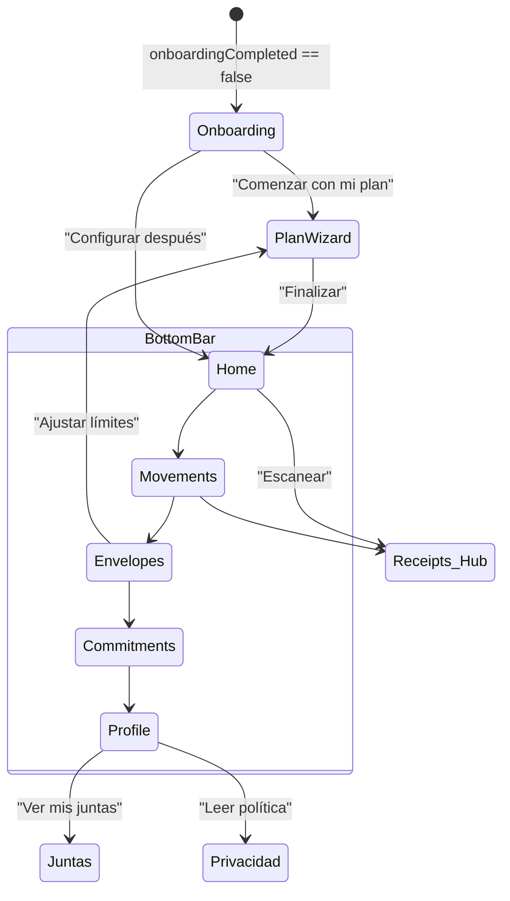
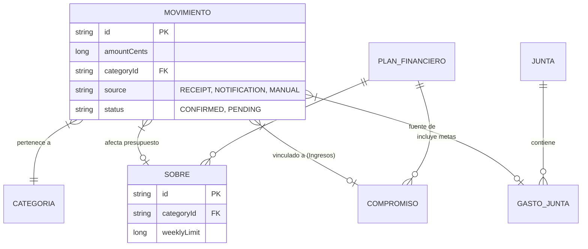
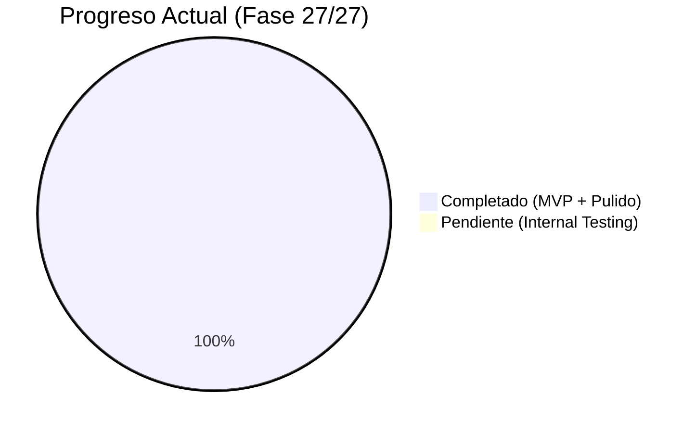

# Mapa Visual y Arquitectónico de Kipu

Este documento sirve como brújula para cualquier desarrollador o IA que trabaje en el proyecto. Está diseñado para ser procesado rápidamente y ahorrar tokens.

## 1. Grafo de Dependencias (Estructura de Módulos)
Kipu utiliza una arquitectura **Clean Architecture Multi-módulo**.

```mermaid
graph TD
    subgraph App
        A[":app"]
    end

    subgraph Características (Features)
        F1[":feature:home"]
        F2[":feature:movements"]
        F3[":feature:envelopes"]
        F4[":feature:commitments"]
        F5[":feature:profile"]
        F6[":feature:plan"]
        F7[":feature:receipts"]
        F8[":feature:juntas"]
    end

    subgraph Núcleo (Core)
        C1[":core:domain"]
        C2[":core:data"]
        C3[":core:designsystem"]
    end

    A --> F1 & F2 & F3 & F4 & F5 & F6 & F7 & F8
    A --> C1 & C2 & C3

    F1 & F2 & F3 & F4 & F5 & F6 & F7 & F8 --> C1
    F1 & F2 & F3 & F4 & F5 & F6 & F7 & F8 --> C3

    F7 --> C2
    F3 --> F2
    C2 --> C1
```

## 2. Flujo de Navegación (User Journey)
Cómo se mueven los datos y el usuario entre pantallas.



## 3. Modelo de Datos (Room v12)
Relación entre las entidades principales de la base de datos.



## 4. Estado del Proyecto (Roadmap)
Visualización de las 27 fases completadas.


