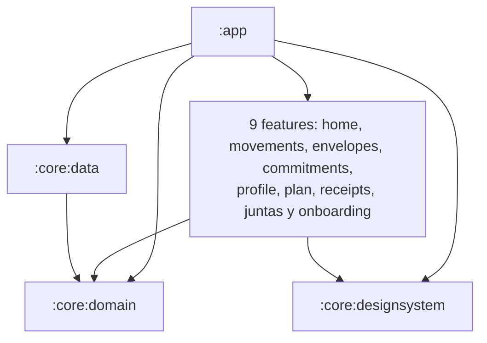
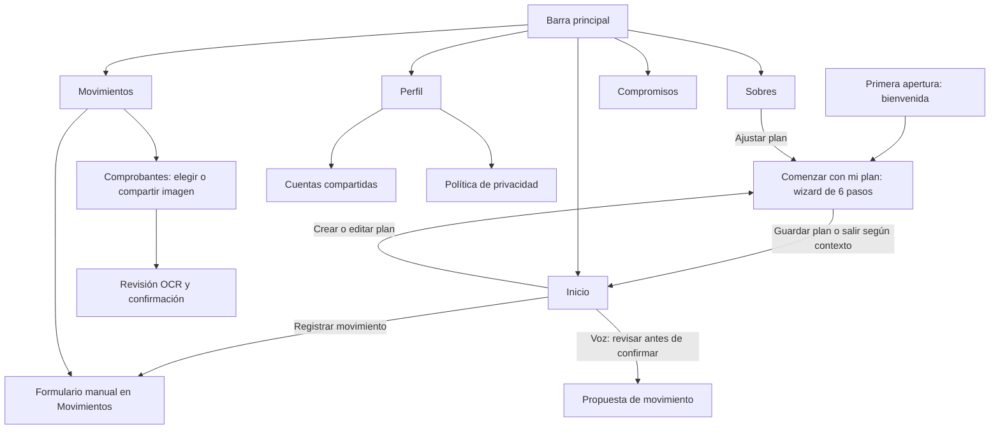
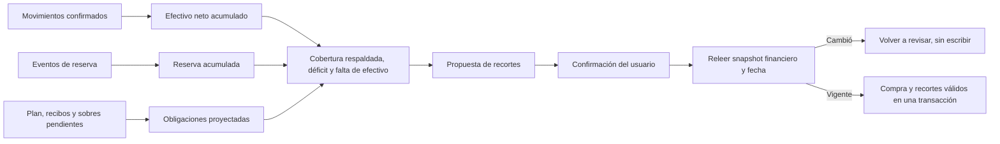

# Mapa visual y arquitectónico de Kipu

Revisión: **12 septiembre 2026**, correcciones locales sobre `bc0547e`. Complementa el [estado vigente](PROJECT_STATE.md) y la [guía funcional](../qa/KIPU_USER_GUIDE.md). Los diagramas resumen relaciones; no certifican todos los flujos. Verificación global PASS y límites pendientes en [Remediación](../qa/REMEDIATION_2026-09-09.md).

## 1. Módulos y dependencias

13 módulos declarados en `settings.gradle.kts`: app, tres core y nueve features. Los nombres internos no siempre son etiquetas de la interfaz.

Dominio JVM puro; data implementa repositorios con Room/DataStore; app integra navegación e inyección. `:feature:juntas` se muestra como **Cuentas compartidas**. Evidencia: `settings.gradle.kts`, archivos `build.gradle.kts` de cada módulo y `app/src/main/java/pe/kipu/app/navigation/KipuNavGraph.kt`.

## 2. Accesos principales

No hay botón «Configurar después» en la bienvenida ni captura con cámara física. El recorrido manual del 9 de septiembre comprobó bienvenida → iniciar wizard → Atrás → Inicio → formulario manual → Atrás → Movimientos → Inicio; no guardó plan ni pagos. Las otras conexiones del mapa proceden de lectura de código, no de una nueva prueba visual completa.

`KipuSpeedDialFab` permanece en el código y en pruebas de componentes, pero no tiene callers de producción en la revisión auditada. Inicio utiliza acciones visibles para voz y registro manual; el fallo aislado de Atrás de ese componente no demuestra un fallo de navegación de Inicio (AUD-L02).

## 3. Persistencia: Room v22

La lista de entidades procede de `core/data/src/main/kotlin/pe/kipu/core/data/local/KipuDatabase.kt`. Esta tabla representa responsabilidades, **no un diagrama de claves foráneas**.

| Entidades | Responsabilidad | Límite relevante |
|---|---|---|
| Movement, Category, Envelope | Movimientos, clasificación y presupuesto por ciclo | Saldo de efectivo y disponibilidad del sobre son medidas distintas |
| Commitment, FinancialPlan | Compromisos y configuración del plan | El ingreso estimado del plan no debe duplicarse como efectivo recibido |
| MonthlyServiceReceipt | Servicio mensual, referencia y vínculo de pago | AUD-H03: DAO transaccional y observador validan existencia, estado y mes del pago |
| ReserveEvent, MovementAudit | Historial de reserva y auditoría de cambios | AUD-H04: fusión con reversas auditables y rechazo de vínculos incompatibles |
| Gathering, GatheringExpense | Cuentas compartidas y gastos repartidos | Nombres internos históricos; no son banca ni sincronización entre usuarios |
| DismissedDuplicatePair | Pares descartados por el usuario | Descartar una sugerencia no elimina los movimientos |

Los eventos de reserva no tienen clave foránea al movimiento por diseño; la reconciliación ocurre en operaciones verificadas, no mediante borrado del historial. Hay migraciones hasta v22 y la corrida previa pasó 54 pruebas de data. Las correcciones actuales no requieren cambio de esquema; no todas las combinaciones posibles de edición/borrado/fusión están certificadas.

## 4. Reserva, efectivo y reajuste

**Límites:** la proyección es conservadora (ciclo actual completo y futuros hasta fin de mes) y depende de registros completos; no cuenta ingresos futuros como caja. Confirmar relee el estado y rechaza una propuesta desactualizada. Los recortes también deben respetar el gasto vigente de la propia compra o se revierte todo. Recortar límites no crea efectivo. No hay rollover individual de sobres; el historial de efectivo y reserva sí persiste entre períodos.

## 5. Línea base histórica, anterior a las correcciones

| Área | Resultado del 9 de septiembre |
|---|---|
| Unitarias | 523 PASS; cobertura porcentual no medida |
| Instrumentadas | 44 app + 43 data PASS; primer fallo de Atrás conservado |
| Lint | Sin errores; 64 advertencias |
| Hallazgos | 4 HIGH, 2 MEDIUM y 2 LOW abiertos |
| Play / build firmada / revisión humana completa | Pendientes, no realizados aquí |

[Auditoría y riesgos](../qa/KIPU_AUDIT_2026-09-09.md) · [Evidencia de comandos](../qa/VERIFICATION_2026-09-09.md) · [Próximas regresiones](E2E_QA_CHECKLIST.md).
